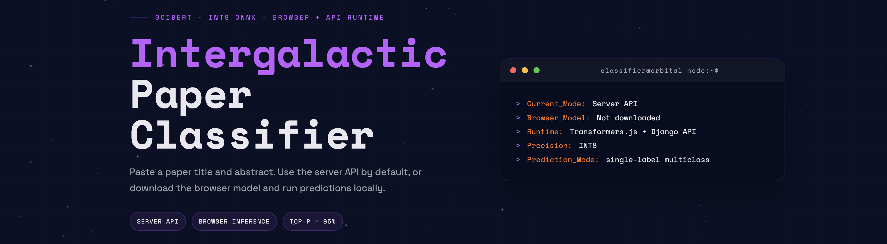

# Intergalactic Paper Classifier

A Django-based paper classifier for arXiv paper subject classification.

The app supports two runtime modes:

- **Server API** by default
- **Browser model** optionally, after downloading the ONNX model into the browser

The browser mode uses a quantized INT8 ONNX model and runs fully client-side.  
The server mode uses the same model family through a lightweight Django API.

## Features

- classify paper **title + abstract**
- browser inference with ONNX
- server-side API included
- top-p = 95% prediction display
- top-5 history saved in browser local storage
- sci-fi styled frontend
- systemd service configuration included

## Repository layout

```text
classifier/          Django app
web/                 Django project package
static/              frontend assets and local browser model
templates/           Django templates
docs/metrics/        evaluation artifacts
deploy/              systemd service file
manage.py            Django entrypoint
pyproject.toml       uv project definition
```


## Installation Guide

### Project initialization:

Clone the repository:
```sh
git clone git@github.com:strangecreator/Intergalactic-Paper-Classifier.git
cd Intergalactic-Paper-Classifier
```


We use modern package manager `uv`:
```sh
curl -LsSf https://astral.sh/uv/install.sh | sh
export PATH="$HOME/.local/bin:$PATH"
```

Check it with:
```sh
uv --version
```

Create `venv` using:
```sh
uv sync
```

Git LFS for model weights:
```sh
apt install -y git-lfs

git lfs install
git lfs pull
```

### Manual running:

```sh
OMP_NUM_THREADS=1 \
MKL_NUM_THREADS=1 \
NUMEXPR_NUM_THREADS=1 \
uv run python manage.py runserver 0.0.0.0:38000 --noreload
```
(you may need to allow `38000/tcp` port via `ufw`)

### Deploy:

Set up and start the systemd daemon:
```sh
sudo cp deploy/intergalactic-paper-classifier.service /etc/systemd/system/
sudo systemctl daemon-reload
sudo systemctl enable intergalactic-paper-classifier
sudo systemctl start intergalactic-paper-classifier
sudo systemctl status intergalactic-paper-classifier
```

Check status via:
```sh
sudo systemctl status intergalactic-paper-classifier
```

Logs can be seen using:
```sh
journalctl -u intergalactic-paper-classifier -f
```

To restart manually run:
```sh
sudo systemctl restart intergalactic-paper-classifier
```

## Licence

MIT